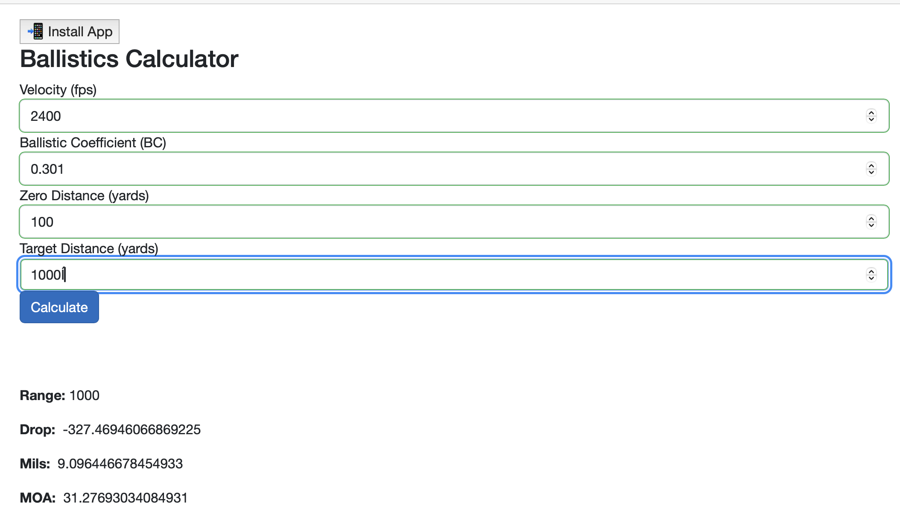

# KBallistics

This is my attempt to make an open-source ballistics solver from first principles using F#. The purpose of this project is to further explore functional programming and physics.

## Requirements

Dotnet 9.0 Sdk installed on your machine.

## Installation & Use

To explore the BallisticsLib.FSharp library simply run `dotnet fsi` and run some calculations using the provided functions.

Alternately, you can `dotnet run` in the KBallistics directory to launch a simple web app which will expose one of these ballistics calculators.

## TODO
- [x] Build initial PWA App
- [ ] Add env variables
    - [ ] Pressure
    - [ ] Wind
    - [ ] Altitdude
